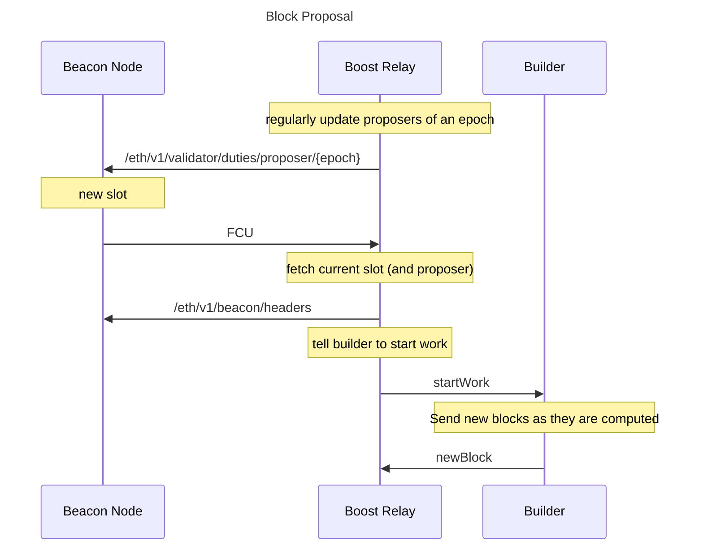

# Boost Relay

Example [mev-boost](https://github.com/flashbots/mev-boost/) relay for Eth2 after the merge.

* Exposes a Builder REST API for mev-boost / CL clients / proposers
* Exposes an API for builders to send blocks
* Exposes a JSON-RPC API to receive [engine_forkchoiceUpdatedV1](https://github.com/ethereum/execution-apis/blob/main/src/engine/specification.md#engine_forkchoiceupdatedv1) (FCU) calls from the BN

## System Architecture

The main question is: how does the builder know which slot and proposer to prepare the block for?

* The beacon-node triggers start of working, using forkchoiceUpdated (FCU)
* FCU doesn't have the slot or the proposer
* We wanted to make minimal changes to the BN to make things work

This relay works as follows:

* We run a beacon node with patched FCU, which calls the relay on every slot (https://github.com/flashbots/lighthouse/pull/1)
* Relay asks BN for current proposer+slot
* Relay calls builder with all infos to trigger block construction

([source](https://excalidraw.com/#json=l2Dy6WbGP59PvfBV4v2Fe,7hHy4xO_wtYpyv04vxfH6g))

