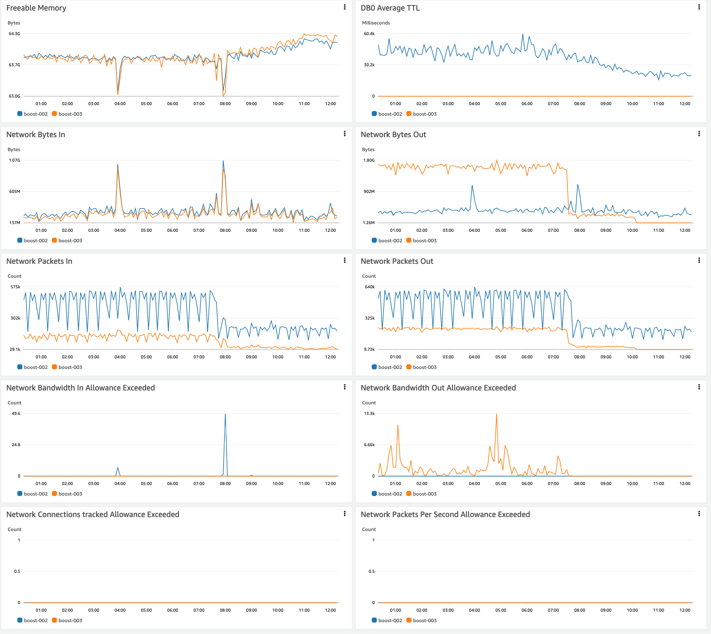
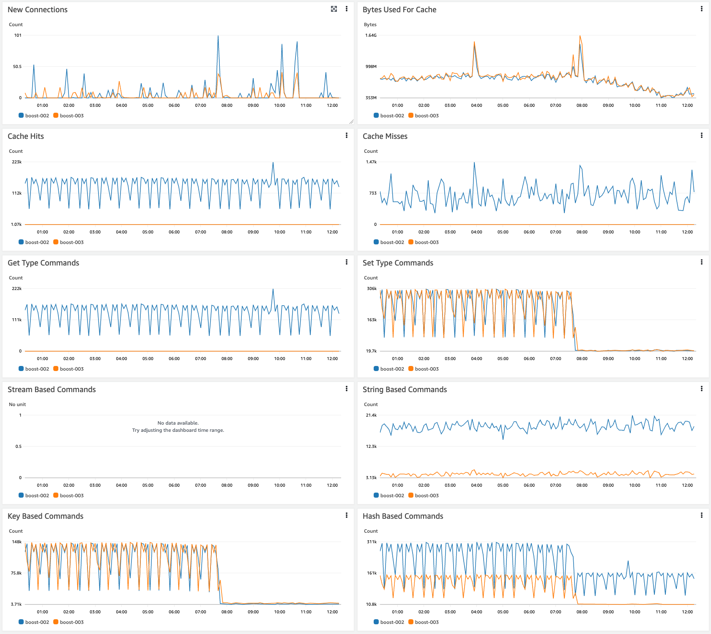
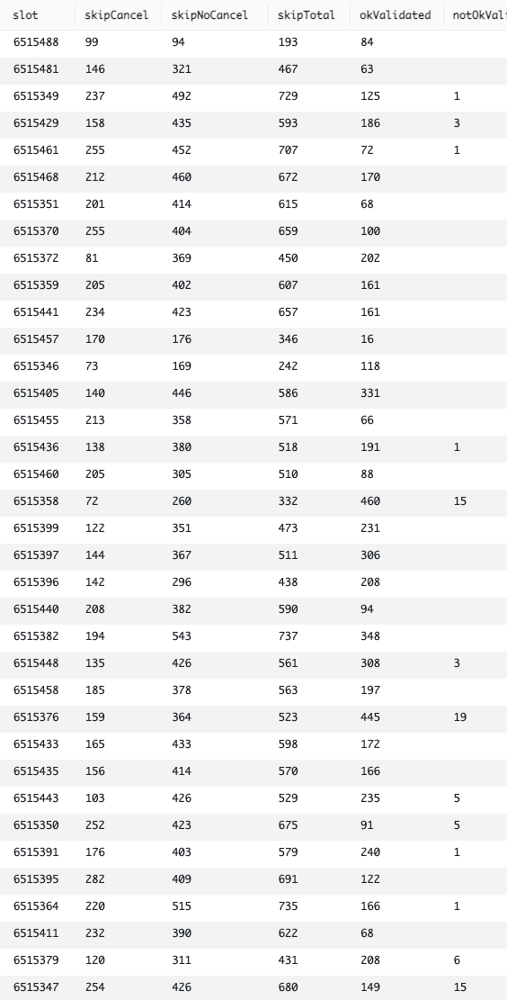
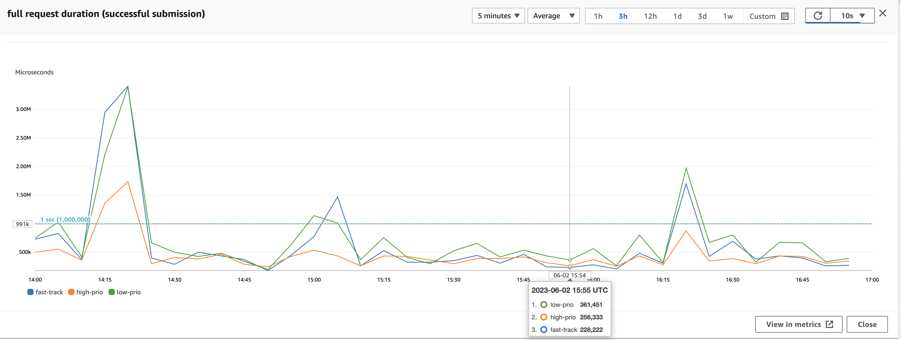

# Recent performance improvements in the mev-boost-relay codebase

2023-06-02, by [@metachris](https://twitter.com/metachris)

See also [part 2 of the performance improvements documentation](20230605-more-redis-performance-improvements.md).

---

There have been a number of significant performance improvements in the mev-boost-relay codebase recently, and I wanted to shine some light on them and add more details and context about the nature of the changes as well as about the impact.

### Fast-track simulation queue

Bids with the highest value so far can get fast-tracked: https://github.com/flashbots/mev-boost-relay/pull/361

### Skipping block submissions which are below the bid floor

Bid floor being the highest non-cancellable bid. The top bid value cannot be lower than that going forward.

- Skipping non-cancellable bids: https://github.com/flashbots/mev-boost-relay/pull/399
- Skipping cancellable bids: https://github.com/flashbots/mev-boost-relay/pull/401

### Redis improvements

- More Redis options (`connPoolSize`, `minIdleConns`, `readTimeout`, `poolTimeout`, `writeTimeout`): https://github.com/flashbots/mev-boost-relay/pull/419
- using Redis pipeline for most requests during block submission: https://github.com/flashbots/mev-boost-relay/pull/435
- After investigating redis `SLOWLOG`, there were two groups of Redis interactions causing the most latency: active validators and known validators (see [`slowlog` output here](https://gist.github.com/metachris/d44fe901cc28f3997d0f2fc234db2b9c)). Improvements with significant impact:
    - Disable 'active validators': https://github.com/flashbots/mev-boost-relay/pull/439
    - Getting known validators directly from CL client instead of through Redis: https://github.com/flashbots/mev-boost-relay/pull/440
- For reference, Flashbots runs Redis in Elasticache, with 2 nodes of type `cache.m6g.4xlarge` (we'll look into downscaling to smaller instance type after these improvements)

---

**These changes resulted both in a significant drop of simulations, as well as reduced Redis load.**

Drop in Redis load:

This table shows the amount of skipped block submissions, versus those that were simulated. On average we can skip around 400-700 submissions per slot, while simulating 100-200:

As an additional relevant data point, these are the average durations of successful block submissions at the Flashbots relay (full request from start of reading until writing the response):

The big spikes correlate with blocks containing rollup transactions which contain much larger transactions and increase the simulation delay.
