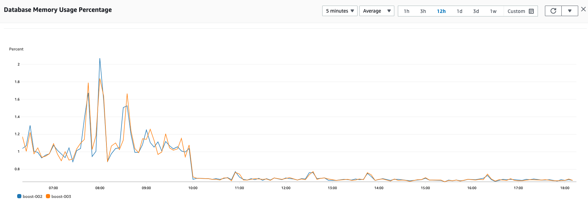
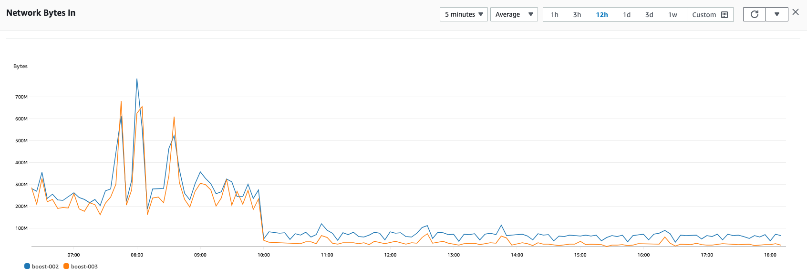
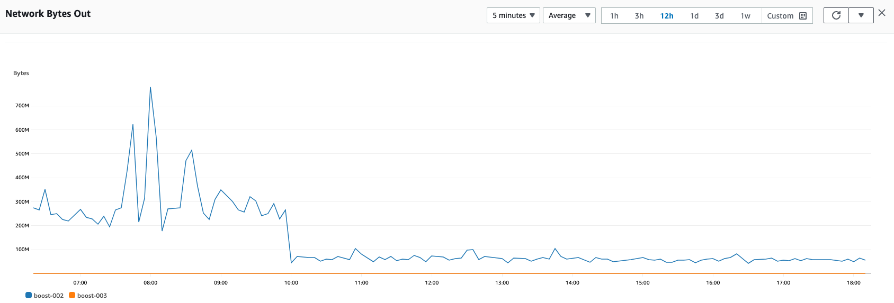
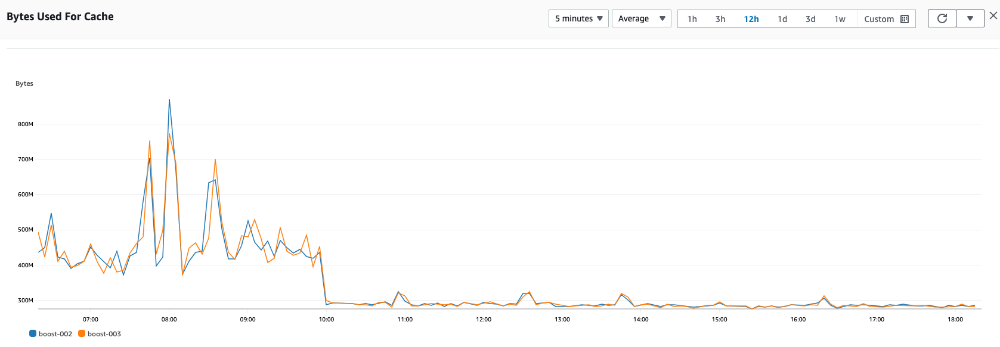
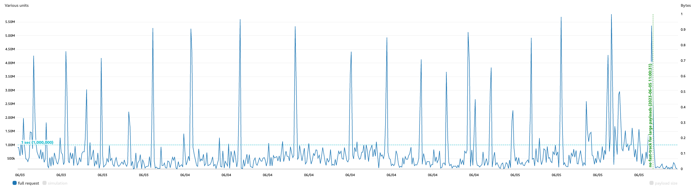
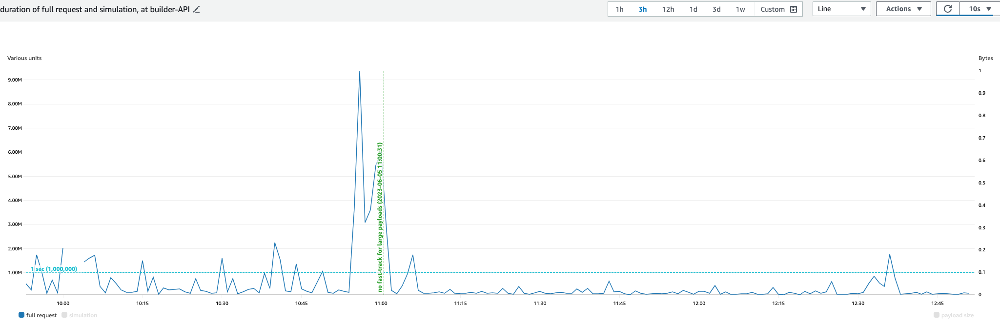

# More Redis performance improvements in the mev-boost-relay codebase

2023-06-05, by [@metachris](https://twitter.com/metachris)

See also [part 1 of the performance improvements documentation](20230602-recent-performance-improvements.md).

---

There have been a few additional significant Redis performance improvements that are worth highlighting:

- [More Redis pipelining for block submissions - PR #447](https://github.com/flashbots/mev-boost-relay/pull/447)
- [Redis: save ExecPayload in SSZ format - PR #448](https://github.com/flashbots/mev-boost-relay/pull/448)

_Shoutout to Benjamin Hunter from Bloxroute who first shared the Redis improvements in [mev-relay#3](https://github.com/bloXroute-Labs/mev-relay/pull/3)._

These changes significantly reduce Redis load, which the following screenshots show in detail:

Additionally, there's a big impact to the performance of fast-tracked submissions in this PR:

- [Don't fast-track large block submissions - PR #451](https://github.com/flashbots/mev-boost-relay/pull/451)

Impact on overall fast-track request duration:

